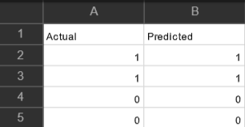

# Разработка модели предсказания реакции на маркетинговые кампании на основе анализа социальных данных и поведения потребителей
## Принцип работы

Проект представляет собой задачу машинного обучения, направленную на создание модели, которая может предсказывать, каким образом потребители отреагируют на маркетинговые кампании. Для этого используются данные о социальных взаимодействиях и поведении потребителей. 

Данные взяты из датасета в Kaggle https://www.kaggle.com/datasets/taseermehboob9/marketing-campaigns-logistic-regression и загружены в GitHub под названием 'Marketingcampaigns.csv'

В коде загружаются необходимые библиотеки. Проводится выбор признаков (features) и целевой переменной (target_variable) и разделение данных на обучающую и тестовую выборки. Далее используются стандартизация признаков с помощью StandardScaler и логистическая регрессия (LogisticRegression) для построения модели предсказания. Проводится настройка гиперпараметров с использованием Grid Search для оптимизации производительности модели. Выводится кросс-валидированная точность и точность на тестовой выборке. В конце создается DataFrame с фактическими и предсказанными метками и сохраняется в CSV-файл.

## Запуск кода
Скачайте данные. Добавьте в 'Файлы' в Google Colab. Переименуйте путь к файлу в загрузках данных, если потребуется.
Или откройте сразу 

## Примечательные моменты
1. Код использует случайный лес (RandomForestClassifier). Это модель, которая может справляться с нелинейными зависимостями в данных.
2. В коде применяется Grid Search (GridSearchCV) для подбора оптимальных гиперпараметров модели. Позволяет автоматически перебирать различные комбинации параметров и выбирать те, которые дают наилучшую производительность.
3. Оценка модели производится с использованием кросс-валидации и вывода метрик точности на обучающей выборке и тестовой выборке. Также добавлен вывод важности признаков для случайного леса.
4. Вывод важности признаков для случайного леса позволяет лучше понять, какие признаки оказывают наибольшее влияние на прогнозы модели.

## Результаты
Результаты модели сохраняются в csv-файле 'model_results.csv'.

Actual (фактические значения): Это реальные результаты или ответы от потребителей на маркетинговые кампании. Например, если у нас есть цель, такая как "потребитель открывал электронное письмо" (1) или "потребитель не открывал" (0), то "Actual" будет содержать фактические значения этой цели на основе исторических данных или данных тестового периода.

Predicted (предсказанные значения): Это значения, которые ваша модель предсказывает на основе входных данных, включая анализ социальных данных и поведения потребителей. Модель стремится предсказать реакцию потребителей на маркетинговые кампании. Например, если ваша модель предсказывает, что потребитель с высокой вероятностью откроет электронное письмо после участия в кампании, то "Predicted" будет содержать предсказанные значения (вероятности, классы и т. д.) для каждого наблюдения.

